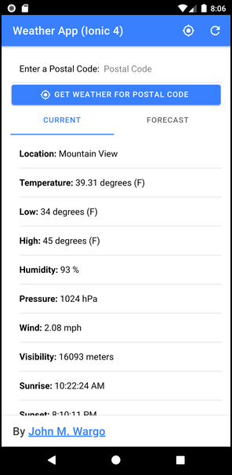
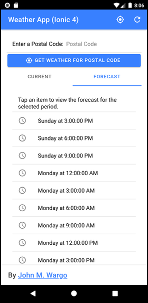
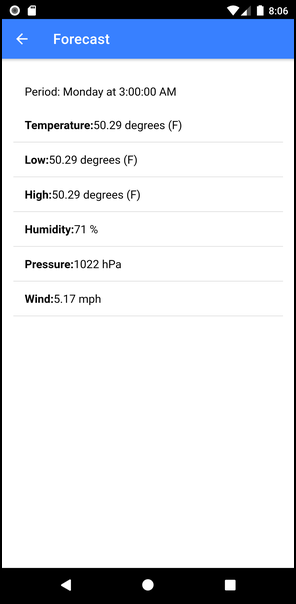

# Weather App - Ionic 4

by John M. Wargo

## Introduction

This is an Ionic 4/Capacitor version of the [TACO Weather App](http://taco.visualstudio.com/en-us/docs/vs-taco-2017-first-app/) solution. I created the [Ionic 2/Cordova](https://github.com/microsoft/cordova-samples/tree/master/weather-app-ionic2) version of this app while I worked on the docs for [Visual Studio 2017 Tools for Apache Cordova (TACO)](https://visualstudio.microsoft.com/vs/features/cordova/). That app hasn't been updated in a while, so I thought I'd give it a refresh. This version of the app is an Ionic Capacitor app; as market interest in Apache Cordova wanes, Capacitor is a robust alternative.

The app uses the [Open Weather Map](http://openweathermap.org/) service to provide current weather conditions and a 5 day forecast; you'll need to update the project's `src/app/config.ts` file with your API key to run the app. The existing file looks like the following:

```TypeScript
export const Config = {
    weatherEndpoint: 'https://api.openweathermap.org/data/2.5/',
    weatherKey: ''
}
```

Populate the `weatherKey` property with your Open Weather Map API Key, then save the changes to the file.

## Application Operation

On start up, the application uses the Apache Cordova Geolocation plugin to determine the current location for the device running the application, then loads the weather conditions for that location. The application's main UI is split using an Ionic Segment (`ion-segment` control); the **Current** segment shows current weather conditions while the **Forecast** segment lists the 5 day forecast for the location. Tap the refresh icon in the upper-right corner of the app's UI to refresh the weather data for the current location.

When a user enters a US Zip Code, the application will retrieve current weather conditions for the specified location.

> **Note:** You can easily convert the app to use city name instead of Zip code. It requires merely changing the endpoint URL for the weather service.  

The following figure shows the contents of the Current segment.



When providing a forecast, the Open Weather API returns an array representing forecast time periods beginning with the following day at midnight (local time). The **Forecast** segment displays an interactive list of the available forecast periods as shown in the following figure:



Tap on a period to open a page containing the detailed weather forecast for the selected period as shown in the following figure.



***

You can find information on many different topics on my [personal blog](http://www.johnwargo.com). Learn about all of my publications at [John Wargo Books](http://www.johnwargobooks.com).

If you find this code useful and feel like thanking me for providing it, please consider <a href="https://www.buymeacoffee.com/johnwargo" target="_blank">Buying Me a Coffee</a>, or making a purchase from [my Amazon Wish List](https://amzn.com/w/1WI6AAUKPT5P9).
